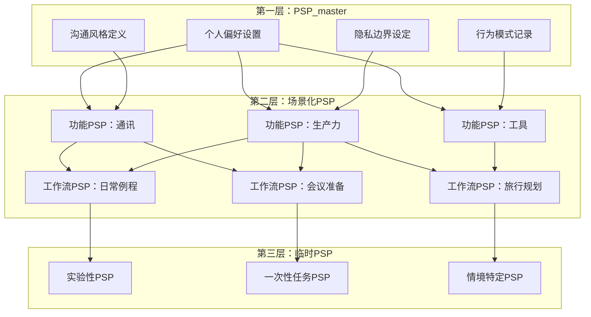
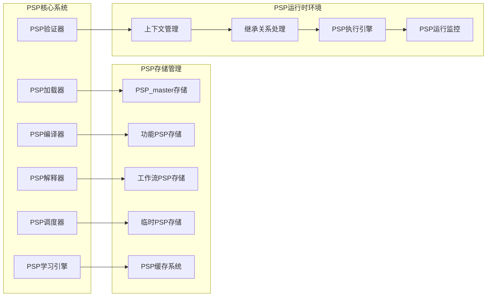
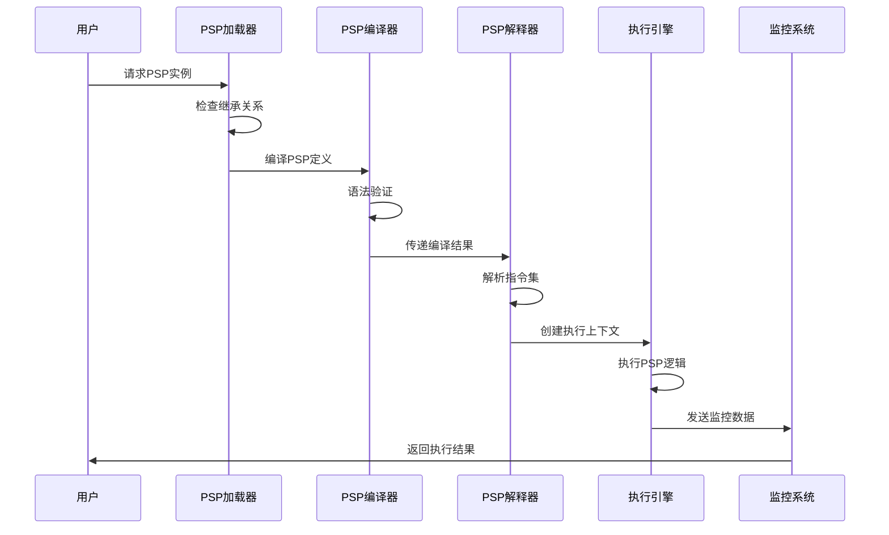
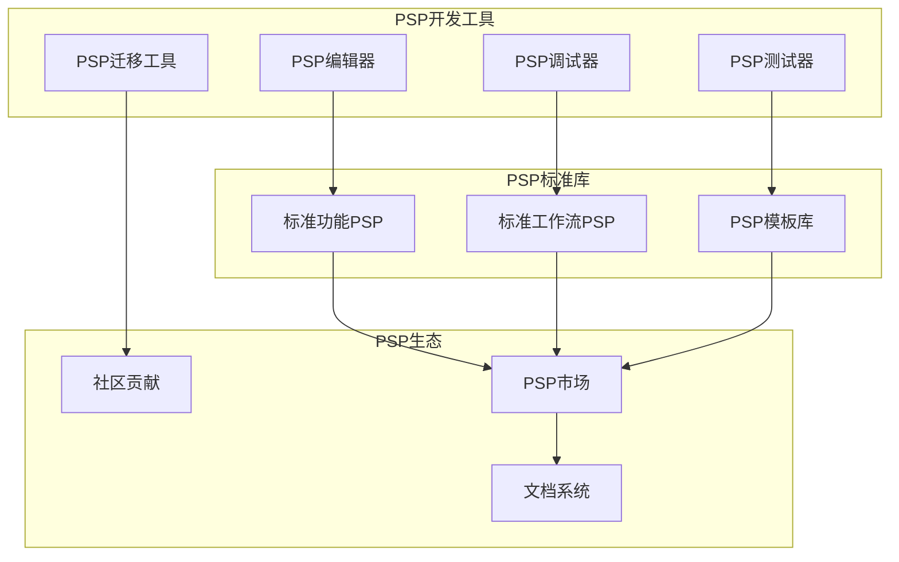
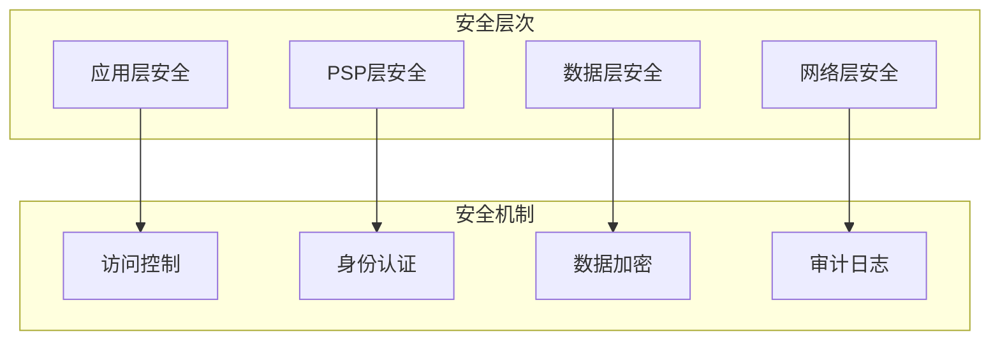

# PSP系统架构设计文档

## 1. 架构概览

PSP (Personal System Prompt) 是notcontrolOS的核心创新，实现了AI时代的"Software 3.0"自然语言编程范式。PSP系统通过分层架构和继承机制，为AI原生应用提供强大的个性化基础。

## 2. 分层架构设计

### 2.1 三层PSP架构



### 2.2 核心组件架构



## 3. PSP继承机制

### 3.1 继承关系图

```yaml
PSP继承体系:
  PSP_master:
    inherit_from: null
    provides:
      - base_context
      - personal_preferences
      - communication_style
      - privacy_boundaries
      - behavioral_patterns
    
  Functional_PSPs:
    inherit_from: PSP_master
    override_allowed:
      - specific_behaviors
      - tool_preferences
      - interaction_patterns
    restrict_access:
      - sensitive_personal_data
      - authentication_tokens
    
  Workflow_PSPs:
    inherit_from: [PSP_master, multiple_functional_PSPs]
    composition_rules:
      - combine_tool_capabilities
      - merge_behavioral_patterns
      - resolve_conflicts_via_priority
    
  Temporary_PSPs:
    inherit_from: [any_parent_PSP]
    lifetime: session_based
    cleanup: automatic
```

### 3.2 访问控制机制

```python
class PSPAccessControl:
    def __init__(self):
        self.access_matrix = {
            'PSP_master': {
                'read': ['self'],
                'write': ['self', 'admin'],
                'inherit': ['functional_PSP', 'workflow_PSP']
            },
            'functional_PSP': {
                'read': ['self', 'parent_master'],
                'write': ['self'],
                'inherit': ['workflow_PSP', 'temporary_PSP']
            },
            'workflow_PSP': {
                'read': ['self', 'composed_functional_PSPs'],
                'write': ['self'],
                'inherit': ['temporary_PSP']
            },
            'temporary_PSP': {
                'read': ['self', 'parent_PSP'],
                'write': ['self'],
                'inherit': []
            }
        }
```

## 4. PSP编译与执行流程

### 4.1 PSP生命周期



### 4.2 PSP编译器设计

```python
class PSPCompiler:
    def __init__(self):
        self.syntax_parser = PSPSyntaxParser()
        self.semantic_analyzer = PSPSemanticAnalyzer()
        self.optimizer = PSPOptimizer()
        self.code_generator = PSPCodeGenerator()
    
    def compile(self, psp_source: str) -> CompiledPSP:
        # 1. 语法分析
        ast = self.syntax_parser.parse(psp_source)
        
        # 2. 语义分析
        validated_ast = self.semantic_analyzer.analyze(ast)
        
        # 3. 继承解析
        resolved_ast = self.resolve_inheritance(validated_ast)
        
        # 4. 优化
        optimized_ast = self.optimizer.optimize(resolved_ast)
        
        # 5. 代码生成
        compiled_psp = self.code_generator.generate(optimized_ast)
        
        return compiled_psp
```

## 5. PSP标准格式规范

### 5.1 PSP YAML格式

```yaml
# PSP标准格式模板
psp_metadata:
  name: "messaging_assistant"
  version: "1.0.0"
  type: "functional"
  layer: 2
  inherit_from: "PSP_master"
  created_at: "2025-01-24T00:00:00Z"
  author: "notcontrolOS Team"
  
psp_config:
  base_prompt: |
    你是一个个性化的消息助手，专门帮助用户处理各种通讯需求。
    你需要根据用户的沟通风格和偏好来调整回复方式。
  
  inheritance:
    from_master:
      - communication_style
      - privacy_preferences
      - language_preferences
      - timezone_settings
    
  tools:
    required:
      - message_sender
      - contact_manager
      - calendar_checker
    optional:
      - translation_service
      - emotion_analyzer
  
  behavior_patterns:
    response_style: "继承自PSP_master"
    formality_level: "adaptive"
    emoji_usage: "based_on_context"
    
  security:
    access_level: "functional"
    data_retention: "session_based"
    logging: "essential_only"
```

### 5.2 PSP接口规范

```typescript
interface PSPI {
    // PSP基础信息
    metadata: PSPMetadata;
    
    // PSP配置
    config: PSPConfig;
    
    // 继承关系
    inheritance: PSPInheritance;
    
    // 核心方法
    execute(input: UserInput, context: ExecutionContext): Promise<PSPResponse>;
    validate(): ValidationResult;
    getInheritedProperties(): InheritedProperties;
    updateLearning(feedback: UserFeedback): void;
}

interface PSPMetadata {
    name: string;
    version: string;
    type: PSPType;
    layer: number;
    inheritFrom: string[];
    createdAt: Date;
    author: string;
}

interface PSPConfig {
    basePrompt: string;
    tools: PSPTools;
    behaviorPatterns: BehaviorPatterns;
    security: SecuritySettings;
}
```

## 6. PSP生态系统

### 6.1 开发工具链



### 6.2 PSP市场机制

```yaml
PSP市场生态:
  贡献机制:
    - 开源PSP提交
    - 社区审核流程
    - 质量认证体系
    - 版本管理机制
  
  分发机制:
    - 分类浏览系统
    - 搜索推荐引擎
    - 依赖关系管理
    - 自动更新机制
  
  质量保证:
    - 自动化测试
    - 安全性扫描
    - 性能基准测试
    - 用户评价系统
  
  激励体系:
    - 贡献者积分
    - 下载量统计
    - 质量评分奖励
    - 社区声誉系统
```

## 7. 性能与监控

### 7.1 PSP性能指标

```yaml
性能监控指标:
  执行性能:
    - PSP加载时间
    - 编译执行时间
    - 内存使用量
    - 响应延迟
  
  质量指标:
    - 用户满意度
    - 错误率统计
    - 继承冲突率
    - 缓存命中率
  
  生态健康度:
    - PSP活跃数量
    - 更新频率
    - 社区参与度
    - 依赖稳定性
```

### 7.2 监控仪表板

```python
class PSPMonitoringDashboard:
    def __init__(self):
        self.metrics_collector = PSPMetricsCollector()
        self.performance_analyzer = PSPPerformanceAnalyzer()
        self.alert_manager = PSPAlertManager()
    
    def get_system_health(self) -> SystemHealthReport:
        return {
            'psp_execution_stats': self.metrics_collector.get_execution_stats(),
            'performance_trends': self.performance_analyzer.get_trends(),
            'active_alerts': self.alert_manager.get_active_alerts(),
            'ecosystem_metrics': self.get_ecosystem_metrics()
        }
```

## 8. 安全和隐私设计

### 8.1 安全架构



### 8.2 隐私保护机制

```yaml
隐私保护策略:
  数据分类:
    - 公开数据: 无限制访问
    - 个人偏好: PSP层级访问
    - 敏感信息: 加密存储，受限访问
    - 私密数据: 本地处理，不上传
  
  访问控制:
    - 基于角色的访问控制 (RBAC)
    - 细粒度权限管理
    - 动态权限调整
    - 审计追踪机制
  
  数据处理:
    - 本地优先处理
    - 最小数据收集
    - 定期数据清理
    - 差异化隐私保护
```

---

**文档版本**: v1.0.0  
**最后更新**: 2025年1月24日  
**维护团队**: notcontrolOS Architecture Team 