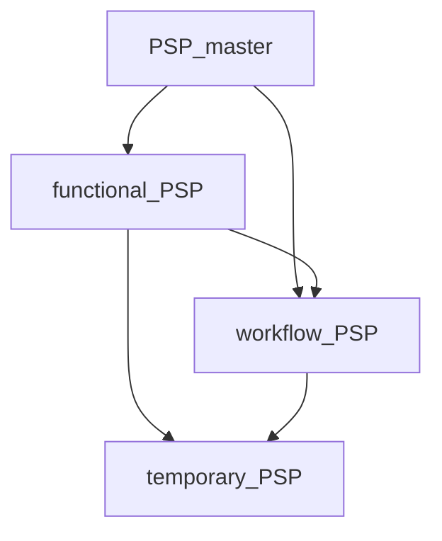

# PSP格式标准规范 v1.0

## 1. 概述

本文档定义了notcontrolOS系统中PSP (Personal System Prompt) 的标准格式规范，确保不同层级的PSP能够正确解析、继承和执行。

## 2. 文件格式

### 2.1 基础要求
- **文件格式**: YAML (.yaml/.yml)
- **编码**: UTF-8
- **命名规范**: 
  - PSP_master: `PSP_master.yaml`
  - 功能PSP: `functional_{name}.yaml`
  - 工作流PSP: `workflow_{name}.yaml`
  - 临时PSP: `temp_{name}_{timestamp}.yaml`

### 2.2 文件结构

```yaml
# PSP标准格式模板
psp_metadata:
  name: string                    # PSP唯一标识符
  version: string                 # 版本号 (语义化版本)
  type: enum                      # PSP类型: master|functional|workflow|temporary
  layer: number                   # PSP层级: 1|2|3
  inherit_from: string?           # 父PSP标识符 (master类型为空)
  created_at: string             # 创建时间 (ISO 8601)
  author: string                 # 作者
  description: string?           # PSP描述
  tags: string[]?                # 标签

psp_config:
  base_prompt: string            # 基础提示词
  
  inheritance:                   # 继承配置
    from_master: string[]        # 从PSP_master继承的属性列表
    override_rules: object?      # 覆盖规则
    
  tools:                         # 工具依赖
    required: string[]           # 必需工具列表
    optional: string[]           # 可选工具列表
    
  behavior_patterns:             # 行为模式
    response_style: string       # 响应风格
    formality_level: string      # 正式程度
    emoji_usage: string          # emoji使用规则
    # 其他自定义行为模式
    
  security:                      # 安全配置
    access_level: enum           # 访问级别: master|functional|workflow|temporary
    data_retention: enum         # 数据保留: session_based|persistent|custom
    logging: enum                # 日志级别: minimal|essential_only|standard|detailed
    encryption_required: bool?   # 是否需要加密
    
  execution:                     # 执行配置
    timeout: number?             # 超时时间(秒)
    retry_count: number?         # 重试次数
    cache_enabled: bool?         # 是否启用缓存
    
  validation:                    # 验证配置
    input_validation: object?    # 输入验证规则
    output_validation: object?   # 输出验证规则
```

## 3. 类型规范

### 3.1 PSP类型定义

```yaml
PSP类型枚举:
  master: "PSP_master - 第1层基础档案"
  functional: "功能PSP - 第2层应用功能"
  workflow: "工作流PSP - 第2层复合流程"
  temporary: "临时PSP - 第3层临时任务"
```

### 3.2 访问级别定义

```yaml
访问级别枚举:
  master: "最高权限，可访问所有资源"
  functional: "功能级权限，可访问指定工具和数据"
  workflow: "工作流权限，可组合多个功能PSP"
  temporary: "临时权限，受限的读取和执行权限"
```

### 3.3 数据保留策略

```yaml
数据保留策略:
  session_based: "仅在会话期间保留"
  persistent: "持久化存储"
  custom: "自定义保留策略"
```

## 4. 继承规范

### 4.1 继承关系图



### 4.2 继承属性列表

```yaml
可继承属性:
  communication_style: "沟通风格"
  privacy_preferences: "隐私偏好"
  language_preferences: "语言偏好"
  timezone_settings: "时区设置"
  behavior_patterns: "行为模式"
  tool_preferences: "工具偏好"
  security_settings: "安全设置"
```

### 4.3 继承规则

1. **功能PSP**: 只能继承自 `PSP_master`
2. **工作流PSP**: 可以继承自 `PSP_master` 或 `functional_PSP`
3. **临时PSP**: 可以继承自任何类型的PSP
4. **属性覆盖**: 子PSP可以覆盖父PSP的特定属性
5. **工具合并**: 子PSP的工具列表与父PSP合并

## 5. 示例

### 5.1 PSP_master示例

```yaml
psp_metadata:
  name: "PSP_master"
  version: "1.0.0"
  type: "master"
  layer: 1
  created_at: "2025-01-24T00:00:00Z"
  author: "notcontrolOS Team"
  description: "用户个人主档案PSP"

psp_config:
  base_prompt: |
    你是我的个人AI助手，需要根据我的个人偏好和习惯来协助我。
    请始终保持专业、友好且高效的沟通方式。
    
  tools:
    required: []
    optional: []
    
  behavior_patterns:
    response_style: "professional_friendly"
    formality_level: "moderate"
    emoji_usage: "contextual"
    
  security:
    access_level: "master"
    data_retention: "persistent"
    logging: "detailed"
```

### 5.2 功能PSP示例

```yaml
psp_metadata:
  name: "functional_messaging"
  version: "1.0.0"
  type: "functional"
  layer: 2
  inherit_from: "PSP_master"
  created_at: "2025-01-24T00:00:00Z"
  author: "notcontrolOS Team"
  description: "消息助手功能PSP"

psp_config:
  base_prompt: |
    你是一个个性化的消息助手，专门帮助用户处理各种通讯需求。
    基于用户的沟通风格，智能地协助起草、回复和管理消息。
    
  inheritance:
    from_master:
      - communication_style
      - language_preferences
      - timezone_settings
      
  tools:
    required:
      - message_sender
      - contact_manager
    optional:
      - translation_service
      - sentiment_analyzer
      
  behavior_patterns:
    response_style: "继承自PSP_master"
    message_tone: "adaptive"
    auto_translation: true
    
  security:
    access_level: "functional"
    data_retention: "session_based"
    logging: "standard"
```

### 5.3 工作流PSP示例

```yaml
psp_metadata:
  name: "workflow_meeting_prep"
  version: "1.0.0"
  type: "workflow"
  layer: 2
  inherit_from: "PSP_master"
  created_at: "2025-01-24T00:00:00Z"
  author: "notcontrolOS Team"
  description: "会议准备工作流PSP"

psp_config:
  base_prompt: |
    你是会议准备工作流助手，负责协调多个功能模块来完成会议前的各项准备工作。
    包括日程检查、资料准备、参会者通知等。
    
  inheritance:
    from_master:
      - communication_style
      - timezone_settings
      
  tools:
    required:
      - calendar_manager
      - document_manager
      - messaging_service
    optional:
      - video_conference_setup
      - presentation_creator
      
  behavior_patterns:
    workflow_steps:
      - check_calendar_conflicts
      - prepare_meeting_materials
      - send_meeting_invitations
      - setup_meeting_room
    automation_level: "semi_automatic"
    
  security:
    access_level: "workflow"
    data_retention: "session_based"
    logging: "standard"
```

## 6. 验证规则

### 6.1 必填字段验证

```yaml
必填字段检查:
  psp_metadata:
    - name
    - version
    - type
    - layer
  psp_config:
    - base_prompt
```

### 6.2 类型约束验证

```yaml
类型约束:
  name: "^[a-zA-Z0-9_]+$"           # 字母数字下划线
  version: "^\\d+\\.\\d+\\.\\d+$"    # 语义化版本
  type: ["master", "functional", "workflow", "temporary"]
  layer: [1, 2, 3]
```

### 6.3 继承关系验证

```yaml
继承关系规则:
  master类型: inherit_from必须为空
  非master类型: inherit_from必须存在
  功能PSP: 只能继承自PSP_master
  工作流PSP: 可继承自master或functional
  临时PSP: 可继承自任何类型
```

## 7. 最佳实践

### 7.1 命名约定

- 使用有意义的描述性名称
- 功能PSP以`functional_`开头
- 工作流PSP以`workflow_`开头
- 临时PSP以`temp_`开头

### 7.2 版本管理

- 遵循语义化版本规范 (SemVer)
- 主要功能变更增加主版本号
- 新功能增加次版本号
- 错误修复增加修订版本号

### 7.3 文档规范

- 为每个PSP提供清晰的描述
- 说明PSP的用途和使用场景
- 记录工具依赖和权限要求
- 提供配置示例

---

**规范版本**: v1.0.0  
**最后更新**: 2025年1月24日  
**维护团队**: notcontrolOS Standards Committee 